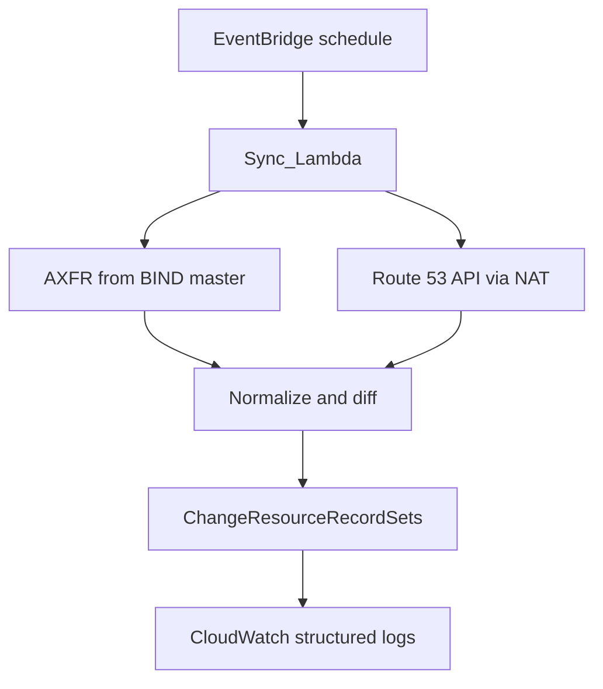

import Tooltip from "@/components/Tooltip.astro";

## Steps

1. <Tooltip term="eventbridge" label="EventBridge" /> invokes Lambda with
   `Domain`, <Tooltip term="master-dns" label="MasterDns" />, `ZoneId`,
   <Tooltip term="ignore-ttl" label="IgnoreTTL" />.
2. <Tooltip term="axfr" label="AXFR" /> full zone from the BIND master
   (authority stays on-prem).
3. List Route 53 records in the <Tooltip term="private-hosted-zone" label="private hosted zone" />.
4. Normalize into <Tooltip term="record-set" label="Record_Set" />s, diff, apply <Tooltip term="change-batch" label="Change_Batch" />es (≤1000 per call).
5. Structured logs to <Tooltip term="cloudwatch" label="CloudWatch" />.

## Log events (healthy run)

| Event           | Meaning                                                           |
| --------------- | ----------------------------------------------------------------- |
| `sync_start`    | Invocation began                                                  |
| `axfr_complete` | Zone transfer finished                                            |
| `diff_summary`  | Creates / upserts / deletes                                       |
| `apply_batch`   | Route 53 change batch submitted                                   |
| `sync_success`  | Mirror completed                                                  |
| `sync_error`    | Fatal failure (`stage`: validation, axfr, r53_read, r53_write, …) |
